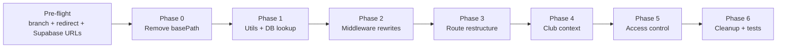

## Decisions baked in
- Root / www: redirects unauthenticated users to `/auth/login`; authenticated users are redirected to their primary tenant subdomain.
- Auth (login/signup/forgot/reset/confirm/logout) lives only on `www.loople.app`. Supabase cookies are emitted with `Domain=.loople.app` so tenant subdomains share the session.
- Reserved subdomains: `www`, `app`, `admin`, `api`, `preview`, `status`, `static`. `admin.loople.app` is reserved for future super-admin; for now it falls through to root behavior.
- Stripe Connect return URLs move to the tenant subdomain (`eastside-fc.loople.app/admin/payments/settings`). This requires re-saving redirect URLs in the Stripe dashboard.

## End-state request flow

```mermaid
flowchart TD
    req[Incoming Request] --> mw[middleware.ts]
    mw --> auth[Refresh Supabase session<br/>Cookie Domain=.loople.app]
    auth --> host{"Hostname?"}
    host -->|"www / loople.app / reserved"| rootCheck{"Authed?"}
    rootCheck -->|no| loginRedir[Redirect to /auth/login]
    rootCheck -->|yes, has club| tenantRedir[Redirect to primary tenant subdomain]
    rootCheck -->|yes, no club| onboard[Redirect to /onboarding]
    host -->|"tenant.loople.app"| lookup[getClubBySubdomain via clubs_public]
    lookup -->|missing| unknown[rewrite to /unknown-tenant]
    lookup -->|found| member{"Path public?"}
    member -->|yes| rw1["rewrite to /s/[sub]/(public)/..."]
    member -->|no, unauthed| toLogin[Redirect to www/auth/login with redirectTo]
    member -->|no, authed non-member| forbidden[rewrite to /s/[sub]/not-a-member]
    member -->|no, authed member| rw2["rewrite to /s/[sub]/(member)/... or /admin/..."]
```

---

## Scope note

This is a multi-week, cross-cutting change (auth, routing, context, RLS, Stripe, emails). Ship each phase on its own PR against the `multi-tenent` branch; do not batch phases. Phases 1-2 can land behind a `ENABLE_SUBDOMAIN_ROUTING` flag if a gradual rollout is desired.

---

## Pre-flight (do before Phase 0)

Three safety items that must be done first. None of these touch the app code beyond a single redirect rule.

### 1. Create the working branch

- Branch name: `multi-tenent` (exact spelling per request; note this is a misspelling of "multi-tenant" - confirm before pushing to origin).
- Base off `main` (or current default). All phases merge into this branch; final squash/merge into `main` only after all phases pass verification.

### 2. Commit this plan to the repo

- Copy the plan contents to [docs/MULTITENANT_PLAN.md](docs/MULTITENANT_PLAN.md) so it lives next to the code and can be referenced from future prompts and PR descriptions.
- Link it from [docs/SUBDOMAIN_ROUTING.md](docs/SUBDOMAIN_ROUTING.md) (created in Phase 1) and [AGENTS.md](AGENTS.md).

### 3. Add transitional redirect + update Supabase allowlist

**Transitional redirect (add in [next.config.ts](next.config.ts) BEFORE Phase 0 removes basePath):**

```typescript
async redirects() {
  return [
    {
      source: '/app/:path*',
      destination: '/:path*',
      permanent: false,
    },
  ]
}
```

- This ships separately from Phase 0 so that any external link pointing to `/app/*` (emails, Stripe return URLs, bookmarks) keeps resolving during and after the basePath removal.
- Keep the redirect in place through Phase 6, then remove it as part of post-launch cleanup.
- Note: this replaces the Phase 6 "add a `/app/:path*` -> `/:path*` redirect for transition" line - it now lives in pre-flight.

**Supabase auth redirect allowlist (done in Supabase Dashboard, not in code):**

- Navigate to Supabase Dashboard -> Authentication -> URL Configuration -> Redirect URLs.
- Add `https://*.loople.app/**` and `https://loople.app/**` to the allowed list.
- Add `http://*.localhost:3000/**` and `http://localhost:3000/**` for local dev.
- Do this BEFORE Phase 2 ships. Without it, any email confirmation / password reset link on a tenant subdomain will be rejected by Supabase.

### Verify before Phase 0
- `git checkout -b multi-tenent` succeeded; `git status` clean.
- `docs/MULTITENANT_PLAN.md` exists in the working tree.
- `curl -I https://www.loople.app/app/dashboard` (production) still returns 307/308 to `/dashboard` after the redirect PR ships.
- Supabase dashboard shows wildcard redirect URL in the allowlist.

---

## Phase 0 - Remove basePath (prerequisite)

Must land first and independently. `basePath: "/app"` will actively break the subdomain rewrite pattern because every rewrite target would need `/app` prepended and Next.js applies `basePath` to rewrites too.

### Files to modify
- [next.config.ts](next.config.ts) - delete `basePath: "/app"`, `assetPrefix: "/app"`, and the `source: "/"` redirect with `basePath: false`.
- [lib/env.ts](lib/env.ts) - remove the `BASE_PATH` field (lines 17-18) entirely. Keep the export shape stable by deleting the key rather than renaming.
- [proxy.ts](proxy.ts) - drop `const basePath = '/app'` and the regex strip on line 43. Redirects on lines 55 and 61 lose the `basePath` prefix. `matcher` on line 74 keeps `'/'` but the comment reasoning changes.
- [app/admin/payments/settings/page.tsx](app/admin/payments/settings/page.tsx) lines 56, 80, 81 - drop `basePath`, use bare paths.
- [app/admin/waitlist/page.tsx](app/admin/waitlist/page.tsx) lines 92-94 - drop `basePath` from shareable URL construction.
- [app/waitlist/apply/page.tsx](app/waitlist/apply/page.tsx) lines 389-390 - drop `basePath`.
- [lib/services/stripe-connect.service.ts](lib/services/stripe-connect.service.ts) lines 130, 134, 139 - drop `basePath` from Stripe return/refresh URLs.
- [app/admin/programs/[programId]/page.tsx](app/admin/programs/[programId]/page.tsx) lines 101-102, 346 - change `/app/programs/...` to `/programs/...`.
- [app/auth/login/page.tsx](app/auth/login/page.tsx) line 63, [app/auth/signup/page.tsx](app/auth/signup/page.tsx) line 216, [app/waitlist/apply/page.tsx](app/waitlist/apply/page.tsx) line 430, [app/waitlist/apply/success/page.tsx](app/waitlist/apply/success/page.tsx) line 13, [components/app-sidebar.tsx](components/app-sidebar.tsx) line 92, [components/newsfeed-sidebar.tsx](components/newsfeed-sidebar.tsx) lines 139, 147, [components/admin/admin-sidebar.tsx](components/admin/admin-sidebar.tsx) line 21, [components/admin/admin-layout-wrapper.tsx](components/admin/admin-layout-wrapper.tsx) line 45 - change image `src="/app/loople-logo3.svg"` to `src="/loople-logo3.svg"` (and `loople-logo-white.svg` similarly). Confirm files exist at [public/](public/) root already; if under `public/app/`, move them up.
- [AGENTS.md](AGENTS.md) line 12 - remove the basePath paragraph.
- [docs/STRIPE_CONNECT_SETUP.md](docs/STRIPE_CONNECT_SETUP.md) lines 39-40 - drop `NEXT_PUBLIC_BASE_PATH` from setup docs.
- [.env.example](.env.example), [.env.local](.env.local) - remove any `NEXT_PUBLIC_BASE_PATH` entries if present (none seen, but sweep).
- [proxy.ts](proxy.ts) `protectedRoutes` array stays the same (routes are already relative).

### Risks / edge cases
- Stripe Connect: any existing `account_links` in flight will use the old `/app/...` return URL. Users mid-onboarding may see 404s briefly. Acceptable - Stripe links are short-lived.
- Cached Vercel builds may still serve `/app/...` - "Clear build cache and redeploy" after merge.
- `/app` prefix appears in one e2e test possibly - grep `e2e/` during execution.

### Verify before Phase 1
- `pnpm build` succeeds.
- `pnpm dev` serves `/` (not `/app/`), `/auth/login`, `/admin`.
- Stripe Connect onboarding completes (manual smoke on a dev account).
- `pnpm lint && pnpm typecheck` clean.

---

## Phase 1 - Foundation (detection + resolution, no behavior change)

All additive. Nothing is wired into request handling yet - safe to land in isolation.

### Files to create
- `lib/utils/subdomain.ts` - pure, testable helpers:
  - `extractSubdomain(host: string, rootDomain: string): string | null` - handles `tenant.loople.app`, `tenant.localhost:3000`, Vercel preview URLs (`*.vercel.app` returns null so preview deployments don't misread), and trailing ports.
  - `isReservedSubdomain(sub: string): boolean` - reserved set: `www`, `app`, `admin`, `api`, `preview`, `status`, `static`.
  - `buildTenantUrl(sub: string, rootDomain: string, path?: string): string`.
  - `buildRootUrl(rootDomain: string, path?: string): string`.
- `lib/utils/__tests__/subdomain.test.ts` - Vitest unit tests covering the above.
- `supabase/migrations/<ts>_add_clubs_subdomain_index_and_public_view.sql`:
  - `create unique index if not exists clubs_subdomain_key on public.clubs (lower(subdomain));` (citext-style uniqueness; adjust if column is already unique).
  - `create or replace view public.clubs_public as select id, name, subdomain, logo_url, onboarding_completed, waitlist_enabled from public.clubs;`
  - `grant select on public.clubs_public to anon, authenticated;`
  - Confirm the view bypasses clubs RLS via `security_invoker=false` or builds as a `security_definer` function - use a function instead if RLS on `clubs` is restrictive: `create function public.club_by_subdomain(sub text) returns table(...) security definer set search_path=public language sql stable as $$ select ... from clubs where lower(subdomain)=lower(sub) limit 1 $$;`
  - Decide between view vs. function based on the current RLS policy - prefer function (tighter, explicit).

### Files to modify
- [lib/services/clubs.service.ts](lib/services/clubs.service.ts) - add `static async getClubBySubdomain(sub: string): Promise<Club | null>` that calls the new RPC/view. Must work with the anon client (no auth required).
- [lib/env.ts](lib/env.ts) - add `ROOT_DOMAIN: process.env.NEXT_PUBLIC_ROOT_DOMAIN ?? "loople.app"`.
- [.env.example](.env.example) - add `NEXT_PUBLIC_ROOT_DOMAIN=loople.app` (with a comment showing `loople.test` or `localhost` for dev).
- [docs/SUBDOMAIN_ROUTING.md](docs/SUBDOMAIN_ROUTING.md) - new doc: how to test `eastside-fc.localhost:3000` (modern browsers resolve `*.localhost` to loopback; document Safari gotcha and `/etc/hosts` fallback).

### Risks / edge cases
- Supabase RLS on `clubs`: the public lookup must not require auth. A `security definer` SQL function is the safest path - confirm search_path is pinned.
- `clubs.subdomain` may contain mixed case / null / duplicates today. Audit data first; migration should include `update clubs set subdomain=lower(subdomain)`.
- Vercel preview deployments have host like `loople-ui-git-branch-user.vercel.app` - `extractSubdomain` must return `null` for these so the full preview acts as root, not a rewrite target.

### Verify
- Vitest passes on `subdomain.test.ts`.
- From a dev script: `ClubsService.getClubBySubdomain('eastside-fc')` returns the expected row when logged out.
- `supabase db reset` succeeds on the migration locally.

---

## Phase 2 - Middleware (core of multi-tenancy)

Single combined middleware handling: session refresh, subdomain extraction, rewrites, and auth redirects.

### Rename and rewrite
- Rename [proxy.ts](proxy.ts) to `middleware.ts` at repo root. The Next 16 proxy naming is equivalent - keeping it `middleware.ts` is the idiomatic Vercel pattern and matches their docs.
- Remove the AGENTS.md note about `proxy.ts`.

### New middleware logic (order of operations)
1. Read `host` from `request.headers.get('host')` (fallback `x-forwarded-host`).
2. Call `extractSubdomain(host, env.ROOT_DOMAIN)`.
3. Build the Supabase SSR client with **cookie options that include `domain: '.' + env.ROOT_DOMAIN`** in production. For localhost, omit the domain (browsers don't honor `.localhost`). This is the key change that makes sessions span subdomains.
4. Call `supabase.auth.getUser()` (existing behavior).
5. Branch on subdomain:
   - **No subdomain or reserved (`www`, `app`, `admin`, `api`, etc.)**: apply current auth redirect rules. Unauthenticated + protected path -> redirect to `/auth/login`. Authenticated on `/` -> (new) query user's primary club and redirect to `https://<primary>.<root>`. Authenticated on auth pages -> redirect to primary tenant.
   - **Tenant subdomain**: call `getClubBySubdomain(sub)` (edge-cached via unstable_cache or a small in-memory LRU). If null -> `NextResponse.rewrite(new URL('/unknown-tenant', request.url))`. Else `NextResponse.rewrite(new URL(\`/s/${sub}${pathname}\`, request.url))`.
6. Auth-gating inside the tenant subdomain:
   - Public paths (`/`, `/waitlist/apply`, `/events` public view, `/profile/[username]` public view): allow anonymous.
   - Protected paths (`/member`, `/admin`, `/messages`, `/settings`): unauthenticated -> redirect to `https://www.<root>/auth/login?redirectTo=<current-full-url>`.
   - Authenticated but not a member of this club: rewrite to `/s/${sub}/not-a-member` (full membership check happens in layout; middleware does a lightweight JWT `app_metadata.club_ids` check if available, otherwise defers to layout).

### Files to modify
- `middleware.ts` (renamed from `proxy.ts`) - full rewrite per above.
- `middleware.ts` `matcher` - change to `['/((?!_next/static|_next/image|favicon.ico|.*\\.(?:svg|png|jpg|jpeg|gif|webp|css|js|map)$).*)']`. Drop the explicit `'/'` line (no longer needed without basePath).
- [lib/supabase.ts](lib/supabase.ts) - when creating the browser client, set cookie options to write with `domain: '.' + env.ROOT_DOMAIN` in production. Match the middleware exactly.

### Risks / edge cases
- **Cookie domain mismatch**: if cookies are set with `Domain=.loople.app` on the server but the browser client writes without a domain (or vice versa), you get two cookies and intermittent sign-outs. The browser SSR client AND middleware must agree. This is the single highest-risk change in the phase.
- **Preview deployments**: `*.vercel.app` can't set `Domain=.vercel.app`. Guard with `env.ROOT_DOMAIN === 'loople.app'` before setting domain; fall back to host-only cookies on previews.
- **Loops**: if the "authenticated on root -> redirect to primary tenant" logic triggers on the tenant, you loop. Strict ordering: redirect only when host is root/reserved.
- **Edge runtime + DB lookup**: `getClubBySubdomain` via PostgREST on every request is too slow. Cache with `unstable_cache({ tags: [\`club:\${sub}\`], revalidate: 300 })` and invalidate on club update.
- **Trailing slash and query strings**: preserve `search` on rewrites (`url.search = request.nextUrl.search`).

### Verify before Phase 3
- Hitting `www.loople.app/` while signed out -> lands on `/auth/login`.
- Hitting `eastside-fc.localhost:3000/` while signed out -> tenant public page loads.
- Hitting `eastside-fc.localhost:3000/admin` while signed out -> redirects to `www.localhost:3000/auth/login?redirectTo=...` (use `.localhost` wildcard).
- Signing in on `www.localhost:3000/auth/login` leaves the cookie in DevTools with `Domain=.localhost` (or host-only on localhost - the fallback path).
- Hitting a bogus `nonexistent.loople.app` -> `/unknown-tenant` page.

---

## Phase 3 - Route structure

The whole tenant app moves under `app/s/[subdomain]/`. Root keeps only auth, onboarding, marketing, and unknown-tenant.

### Final folder layout

```
app/
|-- layout.tsx                       # global providers (unchanged in spirit)
|-- (root)/
|   |-- layout.tsx                   # marketing/root layout
|   |-- page.tsx                     # redirect-shell; actual redirect is in middleware
|   |-- onboarding/page.tsx          # for authed users with no club
|-- auth/                            # stays at root; NEVER rewritten
|   |-- login/ signup/ forgot/ reset-password/ confirm/ logout/
|-- super-admin/                     # stays at root (www.loople.app/super-admin)
|-- unknown-tenant/page.tsx          # middleware rewrites here
|-- s/
|   |-- [subdomain]/
|   |   |-- layout.tsx               # server: resolve club, wrap in TenantProvider
|   |   |-- not-a-member/page.tsx
|   |   |-- (public)/
|   |   |   |-- page.tsx             # public club landing
|   |   |   |-- events/page.tsx      # public event list
|   |   |   |-- profile/[username]/page.tsx
|   |   |   |-- waitlist/apply/page.tsx
|   |   |-- (member)/
|   |   |   |-- layout.tsx           # requires auth + membership
|   |   |   |-- page.tsx             # member newsfeed (current app/page.tsx)
|   |   |   |-- dashboard/ messages/ events/ programs/ post/ settings/
|   |   |-- admin/                   # scoped to this club
|   |   |   |-- layout.tsx           # requires auth + admin-of-this-club
|   |   |   |-- page.tsx + all current /admin subtrees
|-- globals.css, favicon.ico, etc.
```

### Moves (source -> target)
- [app/page.tsx](app/page.tsx) -> `app/s/[subdomain]/(member)/page.tsx`. A new `app/(root)/page.tsx` becomes a thin redirect (middleware handles most).
- [app/dashboard/](app/dashboard/) -> `app/s/[subdomain]/(member)/dashboard/`.
- [app/events/](app/events/) -> split: public listing to `(public)/events/`, member-only flows to `(member)/events/`.
- [app/messages/](app/messages/) -> `(member)/messages/`.
- [app/profile/[username]/](app/profile/[username]/) -> `(public)/profile/[username]/` (public profile page already exists, visibility rules unchanged).
- [app/settings/](app/settings/) -> `(member)/settings/`.
- [app/post/](app/post/) and [app/(dashboard)/post/](app/(dashboard)/post/) -> consolidate under `(member)/post/`.
- [app/(dashboard)/programs/](app/(dashboard)/programs/) -> `(member)/programs/`. The public registration page `programs/[programId]/register/page.tsx` stays publicly accessible (pull into `(public)/programs/[programId]/register/` if it can be anonymous; otherwise stays member-gated with public link via different route).
- [app/waitlist/apply/](app/waitlist/apply/) -> `(public)/waitlist/apply/`. Drop `?club=` query param reliance (subdomain is now authoritative).
- [app/admin/](app/admin/) -> `app/s/[subdomain]/admin/`. Tree and filenames preserved to minimize churn.
- [app/events/loading.tsx](app/events/loading.tsx), [app/messages/loading.tsx](app/messages/loading.tsx), [app/(dashboard)/loading.tsx](app/(dashboard)/loading.tsx) - move alongside their new locations.

### Deletes / consolidations
- [app/(tenant)/layout.tsx](app/(tenant)/layout.tsx) - delete. Pure pass-through; replaced by the real `app/s/[subdomain]/layout.tsx`.
- [app/(dashboard)/](app/(dashboard)/) route group - delete. Its `layout.tsx` is just a centered wrapper; move that class composition into `(member)/layout.tsx` instead.
- [app/status/page.tsx](app/status/page.tsx), [app/event/](app/event/), [app/animations/](app/animations/) - audit during execution; keep at root only if they are cross-tenant dev/debug pages.

### New files
- `app/s/[subdomain]/layout.tsx` - server component. Calls `getClubBySubdomain(params.subdomain)`; `notFound()` if null. Wraps children in `<TenantProvider club={club}>`. **Critical: this layout runs for every page under the tenant tree and provides the server-side source of truth for the club.**
- `app/s/[subdomain]/(member)/layout.tsx` - server component. Validates session via `supabase.auth.getUser()`, confirms membership via RLS-safe query or JWT `app_metadata.club_ids`; on fail, redirect to `/s/[subdomain]/not-a-member` or to login.
- `app/s/[subdomain]/admin/layout.tsx` - replaces [app/admin/layout.tsx](app/admin/layout.tsx). Calls `userHasAdminAccess(supabase, user, clubId)` (new signature - see Phase 5).
- `app/s/[subdomain]/not-a-member/page.tsx` - explains the user isn't a member and offers to apply (link to `/waitlist/apply`) or switch clubs.
- `app/(root)/layout.tsx` + `app/(root)/page.tsx` - minimal root landing; middleware does the actual redirect, but the page exists as fallback.
- `app/(root)/onboarding/page.tsx` - for users with no clubs yet.

### Risks / edge cases
- Code that imports with absolute paths like `@/components/...` is fine; relative imports inside moved files need fixing.
- Dynamic `[subdomain]` param everywhere can be noisy. Add a tiny `useCurrentClub()` hook (Phase 4) so child components never need to read `params.subdomain`.
- `next/link` hrefs that today say `/admin/...` still work because we're on the tenant subdomain and the rewrite is transparent - but any hardcoded absolute URLs (e.g. `https://loople.app/admin`) must be audited.
- Parallel routes, loading.tsx, error.tsx - each moved segment should keep its siblings.

### Verify before Phase 4
- `pnpm build` succeeds with new structure.
- `eastside-fc.localhost:3000/` renders public club page.
- `eastside-fc.localhost:3000/admin` renders admin (when admin).
- `eastside-fc.localhost:3000/nonexistent-route` 404s within the tenant layout (not top-level).
- `www.localhost:3000/super-admin` still works.

---

## Phase 4 - Club context overhaul

Make the URL authoritative. Kill localStorage as the source of truth.

### Files to modify
- [lib/club-context.tsx](lib/club-context.tsx) - major rewrite:
  - `ClubProvider` now requires an `initialClub: Club` prop (supplied by `app/s/[subdomain]/layout.tsx`). This becomes `selectedClub` immediately, synchronously.
  - Remove the "auto-select first club" effect (lines 85-89) and the "restore from localStorage" effect (lines 92-102).
  - `selectClub(club)` becomes `switchClub(club)` that does `window.location.assign(buildTenantUrl(club.subdomain, env.ROOT_DOMAIN, window.location.pathname))`. No in-place state mutation.
  - Keep `clubs: Club[]` (the list of clubs the user belongs to) since the switcher still needs them. Fetching logic stays, but fallback behavior changes.
  - Add `TenantProvider` (new, colocated) that takes `club: Club` from the server layout and seeds `ClubContext`. The existing `ClubProvider` in [app/layout.tsx](app/layout.tsx) stays for root pages where there is no tenant (it renders with `selectedClub=null`). Or split into two providers: `ClubListProvider` (user's clubs for the switcher) vs. `CurrentClubProvider` (URL-derived, for all scoped components). Recommended: split.
- [components/club-switcher.tsx](components/club-switcher.tsx) - change `onSelect` to navigate via `buildTenantUrl`. Add loading state during navigation. Current club is highlighted by comparing to `useCurrentClub()`.
- [app/layout.tsx](app/layout.tsx) - swap `ClubProvider` for `ClubListProvider` (list-only, no selection). `CurrentClubProvider` is injected by the tenant layout.
- [lib/hooks/use-admin-club-page-access.ts](lib/hooks/use-admin-club-page-access.ts) - audit; it likely reads `selectedClub` and compares to something. Ensure it uses `useCurrentClub()` now.
- [docs/CLUB_SWITCHING.md](docs/CLUB_SWITCHING.md) - rewrite. The "Future Enhancements -> Multi-tenancy" note becomes "How it works today".

### New hook
- `useCurrentClub(): Club` (non-nullable) - throws if used outside a tenant subgraph. Read from `CurrentClubContext`.

### Edge cases
- User logs in on `eastside-fc.loople.app` but only belongs to `dolphins`: tenant layout sees no membership -> `not-a-member` page with a "Go to your club" CTA that links to `https://dolphins.loople.app`.
- User belongs to zero clubs: root redirect sends them to `/onboarding`.
- Stripe payment flows (waitlist, programs) use `useClub()`. Changing `useClub()` to `useCurrentClub()` in those files is mechanical but must be verified end-to-end (see the "useClub dependencies" section below).

### Verify before Phase 5
- Club switcher navigates to a new subdomain (no state-only flip).
- `useCurrentClub()` returns the URL's club on every tenant page.
- Stripe waitlist payment flow still works end-to-end on `eastside-fc.localhost:3000/waitlist/apply`.

---

## Phase 5 - Auth + access control tightening

Make the subdomain a first-class security boundary (defense in depth on top of RLS).

### Files to modify
- [lib/auth/admin-access.ts](lib/auth/admin-access.ts):
  - Change `userHasAdminAccess(supabase, user, clubId)` to take a **required** `clubId` parameter.
  - Update internal queries to filter `owner_id=user.id AND id=clubId`, and `members.user_id=user.id AND members.club_id=clubId`, and `users.club_id=clubId AND ...`. Drop the "any club owned" fallback.
  - Add `userIsMemberOfClub(supabase, user, clubId)` helper used by the tenant member layout.
- `app/s/[subdomain]/admin/layout.tsx` (from Phase 3) - calls `userHasAdminAccess(supabase, user, resolvedClub.id)`. Redirects to tenant root (`/`) on fail, not to `/`.
- `app/s/[subdomain]/(member)/layout.tsx` - calls `userIsMemberOfClub`. Redirects to `not-a-member` page on fail.
- `middleware.ts` - opportunistic JWT check only (if `app_metadata.club_ids` is populated). Layouts remain the real gate. Do NOT block in middleware on a DB lookup per request.
- [supabase/functions/_shared/club-access.ts](supabase/functions/_shared/club-access.ts) - already clubId-scoped. No change required, but audit that every edge function that mutates data takes `clubId` from the request body and re-verifies via `assertUserCanManageClub`.

### RLS - the true last line
- Review policies on `clubs`, `members`, `posts`, `events`, `programs`, `registrations`, `payments`, `waitlist_applications`, `messages`, `conversations`, `program_memberships`. Every policy must scope on `club_id` (or derive it through a join). If any policy currently trusts app-level filtering, tighten it now - the subdomain is a convenience, not a security guarantee.
- Add a smoke migration that asserts (via pg regression test or seed script) that user A in club X cannot select rows in club Y.

### Risks
- Existing callers of `userHasAdminAccess(supabase, user)` (no clubId) will fail TypeScript. This is intended - forces a full audit. Grep usage during execution.
- JWT-based opportunistic check requires populating `app_metadata.club_ids` - may need a Supabase trigger on `members` table insert/delete. Optional: skip the JWT short-circuit and let layouts do the DB check.

### Verify before Phase 6
- User in club A navigating to `https://B.loople.app/admin` is redirected/404'd.
- All existing admin pages still work for the correct user.
- Playwright: add `e2e/subdomain-access.spec.ts` (Phase 6) hits known bad cases.

---

## Phase 6 - Cleanup + polish

### Files to modify / create
- [app/waitlist/apply/page.tsx](app/waitlist/apply/page.tsx) (now at `app/s/[subdomain]/(public)/waitlist/apply/page.tsx`) - drop `searchParams.get('club')` reliance (lines 26-27, 51-56). Club comes from `useCurrentClub()` (client) or `params` (server). Backward-compat: if `?club=` is still present in an old email, redirect to the correct subdomain.
- [app/admin/waitlist/page.tsx](app/admin/waitlist/page.tsx) - shareable URL (lines 92-94) builds `https://${selectedClub.subdomain}.${env.ROOT_DOMAIN}/waitlist/apply` instead of query param.
- [lib/services/stripe-connect.service.ts](lib/services/stripe-connect.service.ts) - Stripe return/refresh URLs use `buildTenantUrl(club.subdomain, env.ROOT_DOMAIN, '/admin/payments/settings?stripe=return')`. Requires club subdomain in scope - pass as arg from caller.
- [app/admin/payments/settings/page.tsx](app/admin/payments/settings/page.tsx) - pass `selectedClub.subdomain` into the Stripe call.
- Email templates (Supabase edge functions `send-notification`, invites, waitlist confirmations) - any URL construction must use tenant subdomain. Grep `NEXT_PUBLIC_APP_URL` usage in `supabase/functions/` and replace with a helper that takes club subdomain.
- [supabase/functions/_shared/](supabase/functions/_shared/) - add `buildTenantUrl.ts` helper mirroring the UI util.
- [.env.example](.env.example), deployment docs - document `NEXT_PUBLIC_ROOT_DOMAIN` as required.
- [docs/SUBDOMAIN_ROUTING.md](docs/SUBDOMAIN_ROUTING.md) (from Phase 1) - expand with production verification, cookie domain troubleshooting, and the Vercel wildcard notes.
- [docs/GO_LIVE_CHECKLIST.md](docs/GO_LIVE_CHECKLIST.md) - add subdomain verification steps.
- [AGENTS.md](AGENTS.md) - update to describe `middleware.ts` with subdomain logic (remove Phase 0 basePath paragraph).

### New tests
- `e2e/subdomain-routing.spec.ts` - Playwright:
  - `eastside-fc.localhost:3000/` renders tenant public page and shows the club name.
  - `bogus.localhost:3000/` shows the unknown-tenant page.
  - Logged-in user A can access `A.localhost:3000/admin`; cannot access `B.localhost:3000/admin`.
  - Waitlist apply form works without `?club=` query param.
  - Session persists when navigating from `A.localhost:3000` to `B.localhost:3000` (shared cookie) without re-login.
- `lib/utils/__tests__/subdomain.test.ts` - already added Phase 1; ensure coverage for edge cases (IPv6, port stripping, trailing dot).

### Verify (post-launch checklist)
- [ ] Production DNS wildcard confirmed via `dig *.loople.app`.
- [ ] Two real tenant subdomains resolve and render correctly.
- [ ] Session cookie in DevTools shows `Domain=.loople.app`.
- [ ] Switching clubs via the switcher triggers a full navigation (URL change).
- [ ] Stripe webhook `account.updated` received at the new return URL.

---

## Breaking changes affecting production

1. **URL change**: all `*.loople.app/app/...` URLs become `*.loople.app/...`. The pre-flight `/app/:path*` -> `/:path*` redirect in [next.config.ts](next.config.ts) covers external inbound links (emails, Stripe receipts, bookmarks). Keep it in place through Phase 6, then remove after a 30-day grace period.
2. **Cookie domain**: existing session cookies on `www.loople.app` (host-only) will no longer match after the domain is broadened to `.loople.app`. All users log out once on first deploy post-Phase 2. Announce this.
3. **Club switching UX**: switching clubs now triggers a page load instead of a soft state change. Slower but correct.
4. **Stripe Connect return/refresh URLs**: must be re-added in the Stripe dashboard if whitelisted (typically not required, but check the Connect settings).
5. **Supabase auth redirect URLs**: in Supabase Dashboard -> Authentication -> URL Configuration, add `https://*.loople.app/**` as allowed redirect URL. This is a required prod prerequisite.

## Stripe implications specifically

- [lib/services/stripe-connect.service.ts](lib/services/stripe-connect.service.ts) and [app/admin/payments/settings/page.tsx](app/admin/payments/settings/page.tsx) build return URLs with `${origin}${basePath}/admin/payments/settings`. Phase 0 removes basePath; Phase 6 switches `origin` from `env.APP_URL` to the tenant-specific origin.
- [app/waitlist/apply/page.tsx](app/waitlist/apply/page.tsx) uses Stripe Payment Element and depends on `searchParams.get('club')`. After Phase 6 the club is the subdomain - a payment intent created for club A on subdomain A cannot be paid on subdomain B. Confirm server-side validation in [supabase/functions/create-payment-intent/index.ts](supabase/functions/create-payment-intent/index.ts) matches `club_id` against the tenant.
- Stripe webhooks ([supabase/functions/stripe-webhook](supabase/functions/stripe-webhook), [supabase/functions/stripe-connect-webhook](supabase/functions/stripe-connect-webhook)) are domain-agnostic (server-to-server). No change needed, but verify the webhook URL in Stripe is still reachable (it is - it points at Supabase, not the app).

## Supabase RLS implications

- `clubs_public` view or function must be callable as anon. Use `security definer` function with pinned `search_path` to avoid exposing non-public columns.
- All tenant-scoped tables must already scope by `club_id` in RLS. Audit every policy once before Phase 5 merges. The existing [supabase/functions/_shared/club-access.ts](supabase/functions/_shared/club-access.ts) is correct but is per-function; the DB policies are the ultimate guard.
- No RLS changes are strictly required for the subdomain migration to work - RLS already enforces data isolation. The subdomain is a UX and middleware-level boundary on top.

## useClub() dependency map (Stripe + more)

Grep shows `useClub` consumed by (non-exhaustive, will audit in execution):
- [components/club-switcher.tsx](components/club-switcher.tsx) - Phase 4 rewrite.
- Waitlist admin page, waitlist apply page - Phase 6 rewrite to use `useCurrentClub()`.
- Stripe Connect settings - Phase 6.
- Admin layouts and scoped admin pages - Phase 5.
- Programs and events scoped flows - behavior-preserving swap from `useClub` to `useCurrentClub`.

Plan: keep `useClub` as a thin alias to `useCurrentClub` during Phase 4 so file-by-file migration can happen without a big-bang rename. Remove the alias in Phase 6.

## Order of operations (summary)



Each phase is independently shippable on its own PR into the `multi-tenent` branch. Pre-flight and Phase 0 have no multi-tenant value by themselves - they must ship first regardless. Phases 1-2 can ship behind a feature flag (e.g. `ENABLE_SUBDOMAIN_ROUTING`) if you want middleware to only rewrite when flag is on during rollout.